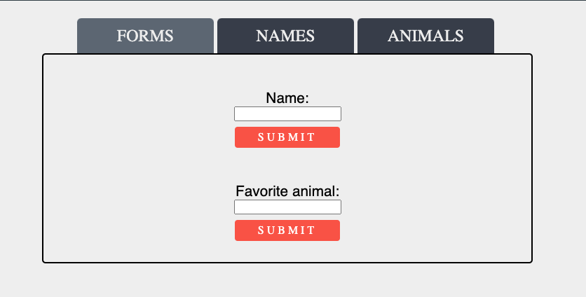

# Instructions

- npm install then npm start to run project in localhost:3000
- used StyledComponents
## Notes

- Data persits between tabs except for names.
- Tried out https://react-hook-form.com/ for form validation

## Things I've concidered

- Both tab 2 and tab 3 could be one reusable component instead.
- I assumed a list was to be displayed not one entry on tab 2 and 3.
- Instead of {name:'',animal:''} as a data structure, I seperated them into two states (Since the names data does not persist).
